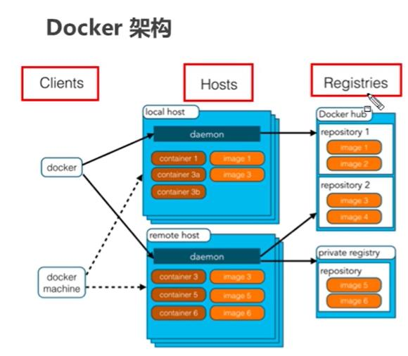
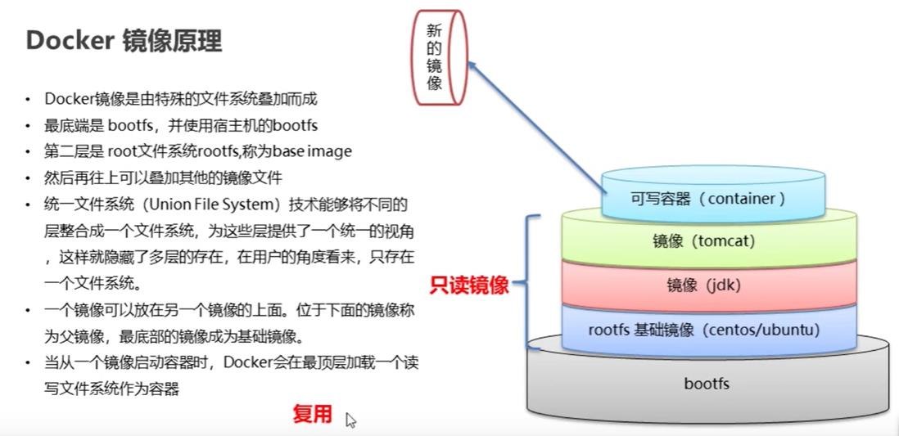
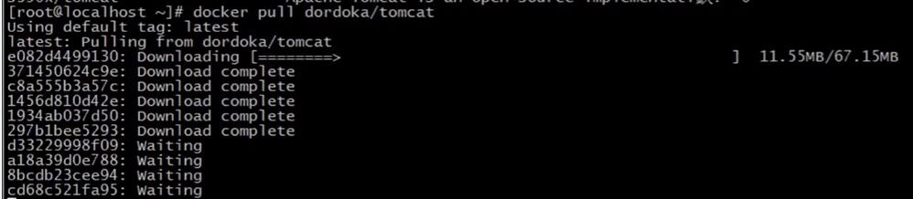
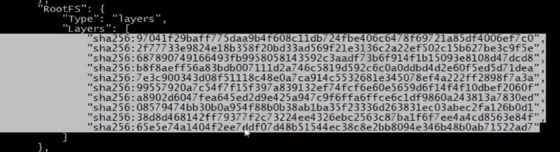

# 一、初始docker
> 作者：wdk  时间：2021年3月17日  
> 官网：https://www.docker.com  
> Docker-hub: https://hub.docker.com

*    开发环境
*    测试环境
*    生产环境

> * Docker是一个开源的应用容器引擎，使得开发者可以打包应用以及依赖包到一个轻量级、可移植的容器中，然后发布到任何`linux`机器上。
> * 容器完全使用沙箱机制，相互隔离，即各个docker间互不影响。
> * 容器性能开销极低。

> **总结：Docker是一种容器技术，解决`软件跨环境迁移`的问题。**

# 二、安装docker【转自wzx师兄】

安装时需要通过设置CENTER_IP环境变量设置中心机的IP地址，以添加中心机的私有docker仓库，实现拉取各种代码的环境。建议通过DATA_ROOT环境变量将docker数据路径设置在外挂硬盘的路径下，避免对系统盘的空间占用。安装时默认是开启TLS验证的，这样会开启2376端口，可以结合portainer共同管理docker daemon，即使用不到也无妨，因为是经过加密验证的，能保证安全。

- 安装命令：

```shell
# 设置中心机的IP=192.168.9.1；默认数据存储路径/var/lib/docker；默认开启TLS验证
sudo CENTER_IP=192.168.9.1 bash install.sh
# 设置中心机的IP=192.168.9.1；手动设置数据存储路径/disk1/docker_data_root；手动关闭TLS验证
sudo CENTER_IP=192.168.9.1 DATA_ROOT=/disk1/docker_data_root TLS_VERIFY=false bash install.sh
```

## 离线安装包下载步骤

​		为了方便，直接按照官方文档中离线安装的步骤进行下载即可。[文档链接](https://docs.docker.com/engine/install/ubuntu/#install-from-a-package)

​		注意区分不同的系统版本与名称：

```
Ubuntu Focal 20.04 (LTS)
Ubuntu Bionic 18.04 (LTS)
Ubuntu Xenial 16.04 (LTS)
```

​		进入[下载链接](https://download.docker.com/linux/ubuntu/dists/)，选择`xenial`、`bionic`或`focal`，再依次点击`pool/stable/amd64/`，分别将其中3个包的最新版本文件下载下来（看最右边的更新时间）。

​		下载下来后也放入对应的`xenial`、`bionic`或`focal`文件夹下，记得删除旧版本的安装包文件。

​		下载一次离线安装包可以长期使用，需要更新版本时再次按照本文档操作。

## 修改docker设置

- 本文件夹下预先写好了一个json配置文件，主要用于开启`实验性的功能`，构建镜像时用到了其中的`--squash`参数，有利于减小构建生成的镜像体积。同时还配置了几个国内镜像源，后续开发时有如果需要新安装的镜像，下载速度会有提升。
- 对于`TLS验证`部分的内容，参考《新架构中集中管理所有节点机器的docker服务》这个语雀文档。


## 脚本文件：install.sh
```powershell
#!/bin/bash

# 获取当前脚本所在路径
SCRIPT_FOLDER=$(cd "$(dirname "$0")";pwd)

# 设置：docker数据存放根路径、中心机的IP地址、是否开启2376端口的TLS加密
DATA_ROOT=${DATA_ROOT:-/var/lib/docker}
DATA_ROOT=$(readlink -m $DATA_ROOT)
echo "设置docker数据根目录为：DATA_ROOT="$DATA_ROOT

echo "设置中心机的IP地址为：CENTER_IP="$CENTER_IP
regex_ip="(2[0-4][0-9]|25[0-5]|1[0-9][0-9]|[1-9]?[0-9])(\.(2[0-4][0-9]|25[0-5]|1[0-9][0-9]|[1-9]?[0-9])){3}"
if [ "$(echo $CENTER_IP | grep -E "$regex_ip")" = "" ]; then
    echo -e "\e[31m 请设置正确格式的 CENTER_IP 环境变量！ \e[0m"
    exit 1
fi

TLS_VERIFY=${TLS_VERIFY:-true}
if [ "$TLS_VERIFY" = "true" ]; then
    echo "设置开启TLS验证。"
fi

# sudo权限检查
if [ ! $(id -u) -eq 0 ]; then
    echo -e "\e[31m 没有root权限！请使用sudo运行本脚本！（注意将sudo放在环境变量之前） \e[0m"
    exit 1
fi

echo "sleep 5s"
sleep 5s

# 尝试创建数据根路径
sudo mkdir -pv $DATA_ROOT
if [ $? -ne 0 ]; then
    echo "docker数据根目录创建失败！退出"
    exit $?
fi

installOffline(){
    sudo apt-get remove docker docker.io containerd runc
    sudo apt-get update
    sudo apt-get install -y --no-install-recommends lsb-core
    # 获取系统名称参数，例如xenial、bionic、focal
    release=$(lsb_release -cs)
    # 进入当前系统对应的文件夹
    cd $SCRIPT_FOLDER/$release
    # 安装所有下载好的安装包
    files=$(ls .)
    if [ "$files" = "" ]; then
        echo -e "\e[31m 没有找到安装包，请先按照README中的步骤下载安装包 \e[0m"
        exit 1
    fi
    cmd="sudo dpkg -i "$files
    ${cmd}
}

echo "离线安装docker。"
installOffline

# 添加root用户到docker用户组
sudo gpasswd -a $(whoami) docker

# 添加所有普通用户到docker用户组
userlist=$(ls /home)
for user in $userlist
do
	sudo gpasswd -a $user docker
done

# 修改配置文件
# 用jq处理json文件：教程：https://stedolan.github.io/jq/manual/
apt-get install -y --no-install-recommends jq
cat $SCRIPT_FOLDER/daemon_template.json | \
    jq "setpath([\"insecure-registries\", 0]; \"$CENTER_IP:5000\")" | \
    jq "setpath([\"data-root\"]; \"$DATA_ROOT\")" \
    > $SCRIPT_FOLDER/daemon.json
if [ "$TLS_VERIFY" = "true" ]; then
    # 参考《新架构中集中管理所有节点机器的docker服务》这个语雀文档
    cat $SCRIPT_FOLDER/daemon.json | \
        jq "setpath([\"tlsverify\"]; true)" | \
        jq "setpath([\"tlscacert\"]; \"/etc/docker/ca.pem\")" | \
        jq "setpath([\"tlscert\"]; \"/etc/docker/server-cert.pem\")" | \
        jq "setpath([\"tlskey\"]; \"/etc/docker/server-key.pem\")" \
        > $SCRIPT_FOLDER/daemon_tls.json
    sudo mv $SCRIPT_FOLDER/daemon_tls.json $SCRIPT_FOLDER/daemon.json
    sudo cp $SCRIPT_FOLDER/ca.pem $SCRIPT_FOLDER/server-cert.pem $SCRIPT_FOLDER/server-key.pem /etc/docker/
    sudo cp $SCRIPT_FOLDER/docker.service /lib/systemd/system/docker.service
    sudo systemctl daemon-reload
fi
sudo mv /etc/docker/daemon.json /etc/docker/daemon.json.bak
sudo mv $SCRIPT_FOLDER/daemon.json /etc/docker/daemon.json

# 重启docker使设置生效
sudo service docker restart

echo "提示：对于一个非sudo用户，需要先将其添加到docker用户组，并且该用户重新登入bash后，才可以操作docker。目前已经将本机所有用户添加进了docker用户组。"
echo "添加用户到docker用户组：sudo gpasswd -a <user_name> docker"
echo ""
echo "如果需要通过2376端口连接并控制本机docker，需要将本文件夹下的ca.pem、cert.pem、key.pem复制到客户端，连接方法参考《新架构中集中管理所有节点机器的docker服务》这个语雀文档"
```

# 三、Docker架构

* 镜像（Image）：是一个静态的文件，相当于一个root文件系统。
* 容器（Container）：是镜像运行时的实体，可以基于一个镜像创建多个容器。
* 仓库（Repository）：保存所有镜像。
* daemon：docker守护进程

## 3.1 配置Docker镜像加速器
默认是在[docker hub](https://hub.docker.com)上下载，速度慢。

```powershell
# 修改docker的daemon.json文件
vim /etc/docker/daemon.json  
# 添加阿里云镜像源（或其他镜像源），可在阿里云官网上免费获取docker镜像加速url
{
    "registry-mirrors": {"https://......"}
}
# 加载daemon
sudo systemctl daemon-reload
# 重启docker
sudo systemctl restart docker
# 查看docker的状态
sudo systemctl status docker
```
## 3.2 docker 服务命令
开启docker服务：`systemctl start docker`  
停止docker服务：`systemctl stop docker`  
开机自动启动docker服务：`systemctl enable docker` 

## 3.3 docker 镜像命令
* 搜索镜像： `docker research image_name:tag`，若不写tag，则默认下载`tag为latest`的镜像。
若想下载指定tag的镜像，需要访问docker-hub官网查看所下载镜像的所有版本。
* 查看所有的镜像的id： `docker images -q`  
* 删除所有的镜像： `docker rmi 'docker images -q'`

## 3.4 docker 容器命令
* 创建容器：`docker run -it --name 设定容器名 image_name:tag /bin/bash(可缺省，因为默认会启动)`  
注：`-it`启动的容器（称为：交互式容器）退出后，会自动删除。  
    建议使用`-id`创建容器（称为：守护式容器），退出时不删除。
* 查看容器信息： `docker inspect docker_name`

## 3.5 容器的数据卷
```powershell
# 若目录不存在，则会自动创建
-v 宿主机目录：docker内部目录
```
### 数据卷的作用：
- 容器数据持久化：`将容器内数据目录挂载到宿主机`，即使docker异常删除，docker内的数据丢失，但在宿主机上仍存在数据，达到`备份`的目的。
- 外部机器和容器间通信：外部机器通过容器`暴露在外部的端口`实现通信。
- 容器之间数据交换：多个容器挂载`同一个宿主机目录`，即将这个宿主机目录当做`共享目录`，实现数据交换。  

### 数据卷容器  
1. 创建数据卷容器c3
```powershell
docker run -id --name c3 -v /volume image_name:tag /bin/bash
```
2. 创建容器c1、c2，并使用命令`--volumes-from`设置数据卷
```powershell
docker run -id --name c1 --volumes-from c3 image_name:tag /bin/bash
docker run -id --name c2 --volumes-from c3 image_name:tag /bin/bash
```

## 3.6 docker 应用部署
* mysql: 创建容器时的参数  
`-e MYSQL_ROOT_PASSWORD=123456`，初始化mysql的root用户的密码为123456。  
`-v $PWD/conf:/etc/mysql/conf.d`，将当前目录下conf/mysql.cnf 挂载到容器内，挂载`配置目录`。  
`-v $PWD/logs:/logs`,挂载`日志目录`。  
 `-v $PWD/data:/var/lib/mysql`，挂载`数据目录`。

# 四、Dockerfile
## 4.1 Docker 镜像原理
linux文件系统有`bootfs`和`rootfs`组成。不同的linux发行版，一般bootfs相同，而rootfs不同。
- bootfs: 包含bootloader（引导加载程序）和kernel（内核）。
- rootfs： root文件系统，例如linux系统中的`/dev、/proc、/bin、/etc`等标准目录和文件。
> Docker镜像由特殊的`文件系统叠加`而成，最底端是bootfs，并使用宿主机的rootfs。镜像是`分层`的，可由`基础镜像`和`父镜像`生成而来，实现了`复用`。  
Docker镜像的本质：是一个分层的文件系统。
- 一个镜像可以放在另一个镜像上面，位于下面的镜像称为`父镜像`，最底部的镜像是`基础镜像`。

我们在docker pull拉取镜像的时候，通过步骤，可以看出来docker镜像是一个分层文件系统，是由多个下级的镜像叠加而成。如下图所示：

使用`docker inspect container_name` 也可以查看到docker的文件分层机制。


## 4.2 镜像制作
- 打包和加载镜像命令
```powershell
    # 打包镜像
    docker save 镜像名称：tag -o image_name.tar.gz
    # 加载镜像
    docker load -i image_name.tar.gz
```
- 容器转为镜像  
```powershell
    # 将容器转换为镜像
    docker commit 容器id 镜像名称：版本号
```

- dockerfile构建镜像  
每一条指令构建一层，建议使用`\`来连接多个命令，使构建的镜像的层数尽可能的少，这样占用的内存就小了。  

通过dockerfile构建镜像的命令：
```powershell
    docker bulid --squash -f /path/to/dockerfile -t image_name:tag
```
其中：参数`--squash`有利于减小构建生成的镜像体积。

## 4.3 Docker 的服务编排
问题：微服务架构的应用系统包含多个微服务，每个微服务有一个docker，要创建和管理多个docker，比较麻烦。  
> 服务编排：按照一定的业务规则批量管理容器。  
docker-compose 是一个编排多个容器分布式部署的工具，提供命令集管理容器化应用的完整开发周期。  使用`docker-compose.yml`文件定义组成应用的各个docker服务。
- 相关命令
```powershell
    # 一键启动，若不使用 `-f`参数指定执行的yml文件，则默认执行docker-compose文件
    docker-compose up -d
    docker-compose -f define_name.yml up -d
    # 停止
    docker-compose stop
    # 重启
    docker-compose restart
    # 删除所有docker    
    docker-compose rm 
```

# 五、Docker 私有仓库
docker官方的[docker-hub](https://hub.docker.com)是一个用于管理公共镜像的仓库。
为了保证安全，不想被外界所访问，可以搭建docker私有仓库。

## 5.1 私有仓库搭建
```powershell
    # 1. 拉取私有仓库镜像，是官方提供的
    docker pull registry
    # 2. 启动私有仓库容器，默认端口号是5000
    docker run -itd --name=registry -p 5000:5000 registry
    # 3. 打开浏览器，输入url： http://私有仓库的服务器ip:5000/v2/_catalog，  
    # 可以查看当前私有仓库管理的所有镜像，若现在显示{"repositories":[]},表示私有仓库创建成功。
    # 4. 修改docker的daemon.json文件，将私有仓库添加进来，让docker信任此仓库
    vim /etc/docker/daemon.json
    # 在 daemon.json中添加下面这一行
    {"insecure-registries": {"私有仓库服务器的ip：5000"}}
    # 5.重启docker服务
    systemctl restart docker
    # 6. 启动私有仓库，若关闭了，则无法成功上传到该私有仓库
    docker start registry
```

## 5.2 将镜像上传到私有仓库
```powershell
    # 1. 标记镜像为私有仓库镜像
    docker tag ubuntu:18.04 私有仓库服务器ip:5000/ubuntu:18.04
    # 2. 推送到私有仓库
    docker push 私有仓库服务器ip:5000/ubuntu:18.04
```

## 5.3 在私有仓库上拉取镜像
```powershell
    docker pull 私有仓库服务器ip:5000/ubuntu:18.04
```